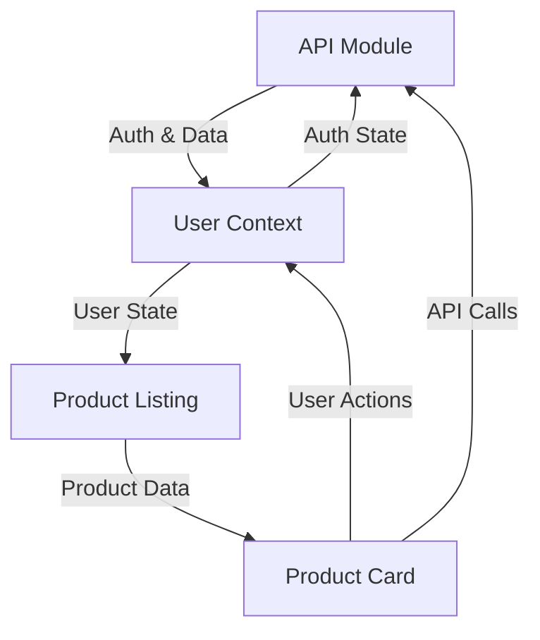

# MHE Bazar - Material Handling Equipment Marketplace


**MHE Bazar** is a comprehensive e-commerce platform for Material Handling Equipment (MHE) in India, serving as a marketplace for forklifts, pallet trucks, stackers, reach trucks, and related equipment. The platform offers sales, rentals, spare parts, and services for industrial businesses.

## 🚀 Technology Stack

### Frontend
- **Framework**: Next.js 15.3.4 with App Router
- **Language**: TypeScript 5.x (Strict mode)
- **Styling**: Tailwind CSS 4.x with shadcn/ui components
- **State Management**: React Hook Form, Custom Hooks
- **Animation**: Framer Motion 12.x
- **Build Tool**: Turbopack
- **Package Manager**: npm
- **Authentication**: JWT with HTTP-only cookies

### Backend
- **Framework**: Django REST Framework
- **Database**: PostgreSQL
- **Authentication**: JWT Authentication
- **File Storage**: Django Storage with AWS S3
- **API Documentation**: Django REST Swagger/OpenAPI

## 🏗️ Project Structure

```
src/
├── app/                    # Next.js App Router pages
│   ├── [category]/        # Dynamic category pages
│   ├── product/           # Product pages
│   ├── vendor-listing/    # Vendor pages
│   └── layout.tsx         # Root layout
├── components/
│   ├── elements/          # Reusable UI elements
│   │   ├── Testimonials.tsx   # Customer review carousel
│   │   └── ...
│   ├── forms/             # Form components
│   ├── home/              # Homepage sections
│   ├── layout/            # Layout components
│   ├── products/          # Product-related components
│   ├── ui/                # shadcn/ui components
│   └── vendor-listing/    # Vendor components
├── lib/
│   ├── hooks/
│   │   ├── useApi.ts     # Custom API hook for data fetching
│   │   └── ...
│   ├── api.ts            # API utilities with error handling
│   └── utils.ts          # Utility functions
└── types/
    └── index.ts          # TypeScript type definitions
```

## 🔌 API Integration

### Authentication Endpoints
```typescript
POST /api/auth/login       // User login
POST /api/auth/register    // User registration
POST /api/auth/refresh     // Refresh token
POST /api/auth/logout      // User logout
```

### Product Endpoints
```typescript
GET    /api/products              // List products
POST   /api/products              // Create product
GET    /api/products/:id          // Get product details
PUT    /api/products/:id          // Update product
DELETE /api/products/:id          // Delete product
POST   /api/products/:id/images   // Upload product images
```

### API Configuration
```typescript
const api = axios.create({
    baseURL: API_BASE_URL,
    headers: {
        "Content-Type": "application/json"
    },
    withCredentials: true
});
```

## 🎯 Key Components

### 1. Testimonials Carousel
```typescript
// Interactive customer review carousel with auto-scroll
<ReviewCarousel>
  <CarouselContent>
    {testimonials.map((item) => (
      <CarouselItem key={item.id}>
        // Testimonial content
      </CarouselItem>
    ))}
  </CarouselContent>
</ReviewCarousel>
```

### 2. File Upload
```typescript
const ProductImageUpload = ({ productId }: { productId: number }) => {
  const { mutate: uploadImages } = useMutation(productAPI.uploadImages);
  // Image upload handling
}
```

## 🔄 Component Flow & Data Architecture

### API Module (`api.ts`)
The API module serves as the central point for all HTTP requests with the following features:

- **Base Configuration**
  ```typescript
  const api = axios.create({
    baseURL: API_BASE_URL,
    headers: { "Content-Type": "application/json" },
    withCredentials: true
  });
  ```

- **Token Management**
  - Automatically attaches JWT tokens to requests
  - Handles token refresh on 401 errors
  - Maintains session persistence using HTTP-only cookies
  - Implements remember-me functionality

- **Error Handling Flow**
  1. Request is intercepted and token is attached
  2. If response is 401 (unauthorized):
     - Attempts token refresh
     - Retries original request with new token
     - Redirects to login if refresh fails
  3. All other errors are propagated to components

### User Context (`UserContext.tsx`)
Manages global user state and authentication:

```typescript
const UserContext = {
  // State
  user: User | null
  isAuthenticated: boolean
  
  // Cart Operations
  cartItems: CartItem[]
  addToCart: (productId: number) => Promise<boolean>
  removeFromCart: (productId: number) => Promise<boolean>
  updateCartQuantity: (productId: number, quantity: number) => Promise<boolean>
  
  // Wishlist Operations
  wishlistItems: WishlistItem[]
  addToWishlist: (productId: number) => Promise<boolean>
  removeFromWishlist: (productId: number) => Promise<boolean>
  
  // Helper Methods
  isProductInCart: (productId: number) => boolean
  isProductWishlisted: (productId: number) => boolean
  getCartItemQuantity: (productId: number) => number
}
```

Data Flow:
1. Wraps application with user context provider
2. Maintains authentication state
3. Provides cart and wishlist operations
4. Syncs with local storage for persistence
5. Triggers UI updates on state changes

### Product Component (`Product.tsx`)
Handles individual product display and interactions:

```typescript
interface ProductCardProps {
  id: number
  image: string
  title: string
  price: number
  // ...other product details
  
  // Callbacks
  onAddToCart: (id: number) => void
  onWishlist: (id: number) => void
  // ...other handlers
}
```

Component Flow:
1. Receives product data and callbacks as props
2. Renders product information using responsive layout
3. Handles user interactions (cart, wishlist, share)
4. Shows appropriate UI states (loading, error, success)
5. Implements lazy loading for images
6. Manages product availability states

Key Features:
- Fallback image handling
- Price formatting with currency
- Dynamic button states based on product type
- Mobile-optimized touch interactions
- SEO-friendly product URLs

### Product Listing (`ProductListing.tsx`)
Manages product grid/list display and filtering:

```typescript
interface ProductListingProps {
  products: Product[]
  totalCount: number
  onFilterChange: (filterValue: string, filterType: string) => void
  selectedFilters: Set<string>
  // ...pagination and sorting props
}
```

Data Flow:
1. Receives filtered products from parent
2. Handles pagination state
3. Manages view modes (grid/list)
4. Controls filter sidebar visibility
5. Implements sort functionality
6. Updates URL parameters for shareable filters

Features:
- Grid/List view toggle
- Responsive filter sidebar
- Dynamic product count
- Advanced pagination
- Sort options
- Mobile-optimized filters

### Component Interaction Flow



1. **Initial Load**
   - UserContext initializes with stored auth state
   - ProductListing fetches products via API
   - Products render with current cart/wishlist state

2. **User Interactions**
   - Product card actions trigger UserContext methods
   - UserContext updates state and calls API
   - API responses update UserContext
   - Components re-render with new state

3. **Error Handling**
   - API errors propagate to UserContext
   - UserContext provides error state to components
   - Components show appropriate error UI
   - Automatic retry for network issues

4. **State Persistence**
   - UserContext syncs with localStorage
   - API maintains token refresh cycle
   - URL parameters store filter state
   - Cart/wishlist survive page reloads

### Performance Considerations

- **Caching Strategy**
  - Product data cached in memory
  - Image lazy loading and optimization
  - Debounced filter updates
  - Pagination for large datasets

- **State Management**
  - Minimized context updates
  - Memoized component renders
  - Optimized re-render conditions
  - Efficient data structures for filters

- **Network Optimization**
  - Request deduplication
  - Parallel API calls when possible
  - Optimistic UI updates
  - Retry mechanism for failed requests

## 🛠️ Getting Started

### Prerequisites
- Node.js 18.18.0+ or 20.0.0+
- Python 3.8+
- PostgreSQL
- npm

### Frontend Installation
1. Clone the repository:
```bash
git clone <repository-url>
cd mhebazar
```

2. Install dependencies:
```bash
npm install
```

3. Set up environment variables:
```bash
cp .env.example .env.local
```

4. Configure environment variables:
```env
NEXT_PUBLIC_API_BASE_URL=http://localhost:8000/api
NEXT_PUBLIC_APP_URL=http://localhost:3000
NEXT_PUBLIC_CONTACT_PHONE=+91 73059 50939
NEXT_PUBLIC_CONTACT_EMAIL=info@mhebazar.com
```

5. Run the development server:
```bash
npm run dev
```

### Backend Setup
1. Create virtual environment:
```bash
python -m venv venv
source venv/bin/activate  # Linux/Mac
.\venv\Scripts\activate   # Windows
```

2. Install dependencies:
```bash
pip install -r requirements.txt
```

3. Configure Django settings:
```python
# settings.py
CORS_ALLOWED_ORIGINS = [
    "http://localhost:3000"
]

REST_FRAMEWORK = {
    'DEFAULT_AUTHENTICATION_CLASSES': [
        'rest_framework_simplejwt.authentication.JWTAuthentication',
    ]
}
```

4. Run migrations:
```bash
python manage.py migrate
```

5. Start backend server:
```bash
python manage.py runserver
```

## 🔒 Security Features

- JWT Authentication with HTTP-only cookies
- Request interceptors for token management
- CORS configuration
- Input validation and sanitization
- Error boundaries
- API error handling

## 🎨 UI Components

- Custom Dialog components
- Avatar components with fallback
- Carousel with touch support
- Form components with validation
- Loading states and error messages
- Responsive navigation
- Mobile-optimized layouts

## 📱 Mobile Considerations

- Touch-friendly interfaces
- Responsive images
- Optimized loading states
- Gesture-based interactions
- Mobile-first design approach

## 🚀 Deployment

### Frontend (Vercel)
1. Connect repository to Vercel
2. Configure environment variables
3. Deploy

### Backend (Production)
1. Configure Django settings for production
2. Set up PostgreSQL database
3. Configure NGINX/Apache
4. Set up SSL certificates
5. Deploy using Gunicorn

## 📞 Support

- **Business Inquiries**: info@mhebazar.com
- **Technical Support**: +91 73059 50939
- **Documentation**: See `Rules` file

## 🤝 Contributing

1. Follow TypeScript guidelines
2. Maintain component structure
3. Add proper error handling
4. Include tests
5. Update documentation

---

**MHE Bazar** - Empowering India's Material Handling Equipment Industry
